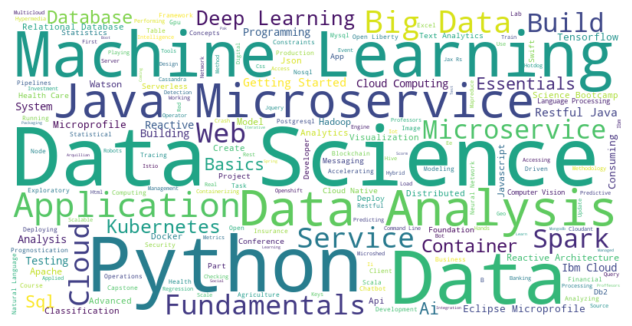
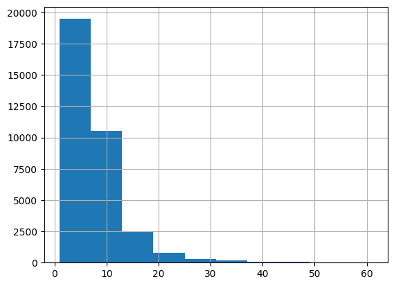
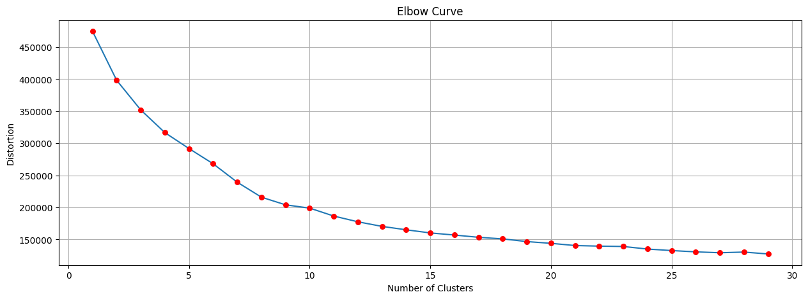
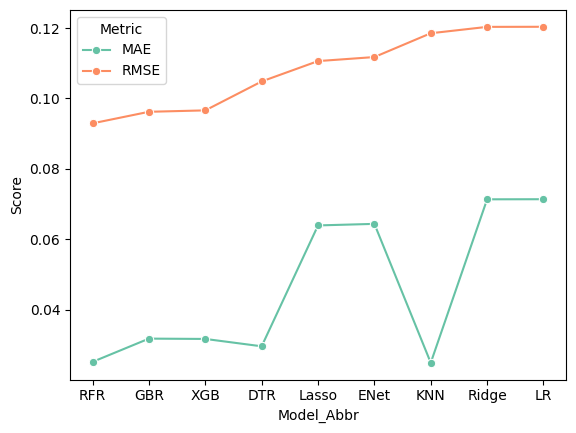
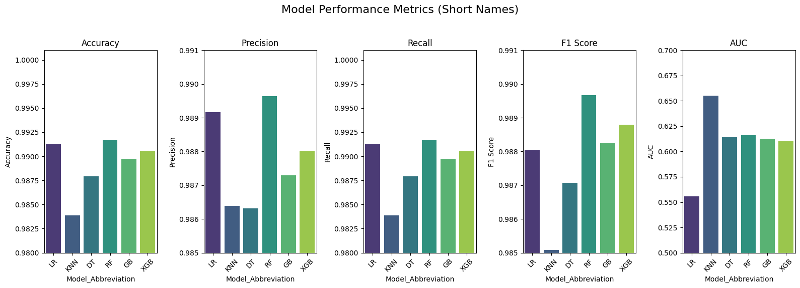
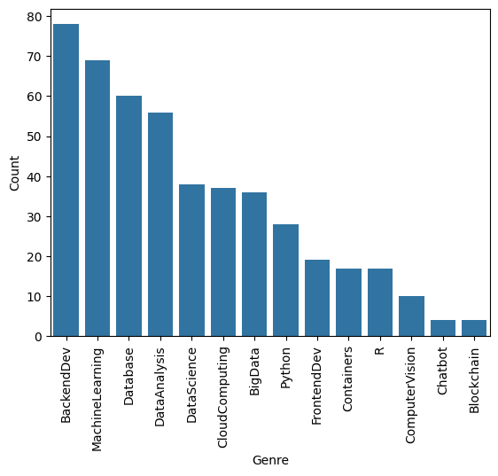
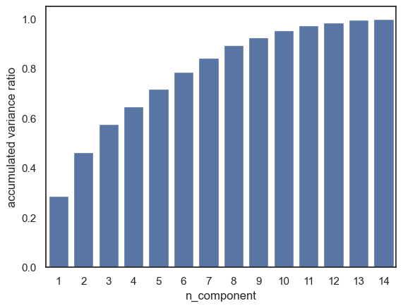
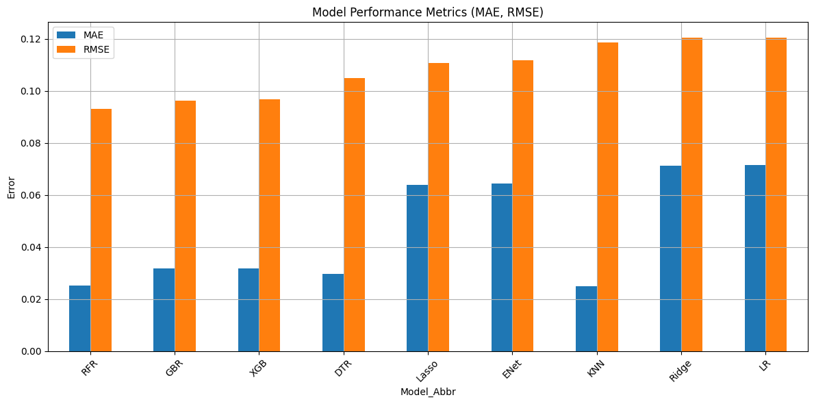
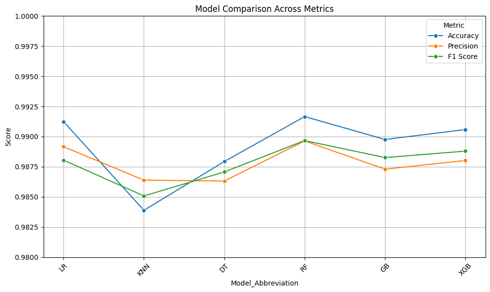

# 🎓 Personalized Course Recommendation System

A smart, course recommender built using hybrid collaborative filtering, machine learning, and deep learning models — deployed seamlessly with Supabase and Streamlit.


<a href="https://personalized-course-recommendation-system.streamlit.app/">→Live Demo<a/> 
---


---

## 📌 Overview

This project recommends personalized learning courses to users based on their learning history using multiple algorithms. It supports both **new** and **existing users**, offering tailored recommendations through multiple ML/Deep Learning techniques:

- ✅ Collaborative Filtering
- ✅ Clustering with KMeans + PCA
- ✅ Neural Collaborative Filtering (NCF)
- ✅ Embedding-based Regression & Classification
- ✅ Content-based Course Similarity
- ✅ User Profile Modeling

All models are trainable and deployable directly from the Streamlit interface, integrated with Supabase for data persistence.

---

## 🧠 Features

- 📈 **Dynamic Model Selection**: Choose from various algorithms based on the user’s data.
- 🧩 **NCF (Neural Collaborative Filtering)**: For deep learning-based recommendations.
- 🧠 **Clustering with PCA**: Groups similar users for smarter predictions.
- 📚 **Content-Based Filtering**: Uses course metadata and BOW representations.
- 🧠 **Regression & Classification Embedding Models**: Generate custom user/item features for improved accuracy.
- ☁ **Supabase Integration**: All data (ratings, courses, models, embeddings) is stored, updated, and retrieved from a scalable PostgreSQL backend via Supabase.
- 📊 **EDA, KMeans Elbow, Similarity Heatmaps, Hyperparameter Tuning**: Visualized and saved as part of analysis.

---

## 🛠️ Tech Stack

| Tool | Purpose |
|------|---------|
| **Python** | Core language |
| **Pandas, NumPy** | Data manipulation |
| **scikit-learn** | ML algorithms & preprocessing |
| **TensorFlow/Keras** | Deep learning models |
| **Supabase** | Backend DB and Storage |
| **Streamlit** | Web app interface |
| **AgGrid** | Interactive tables |
| **dotenv** | Secure env handling |

---

## 🚀 How It Works

1. **User Identification**

   * A user either selects **“New”** or enters their **existing User ID** via the Streamlit sidebar.
   * For **new users**, selected completed courses are pushed to the `Ratings` table in Supabase.

2. **Model Training Phase**

   * Streamlit triggers the selected model training using backend logic.
   * During training:

     * The UI displays **live runtime updates** (⏱️ in minutes and seconds).
     * For embedding-based models, custom user/item features are learned using neural layers.
   * Once training is complete:

     * The trained model (e.g., RandomForest, KMeans, NCF) is serialized and saved as a `.xz` compressed pickle file.
     * The model file is uploaded or updated in the **Supabase Storage bucket**.
     * A record is added to the `User_Model_Map` table to track which model was trained by that user.

3. **Retraining Logic**

   * If an **existing user** adds more completed courses:

     * New course ratings are inserted into `Ratings`.
     * All previous models for that user are **deleted from `User_Model_Map`** to ensure retraining on fresh data.

4. **Prediction Phase**

   * When a trained model is selected:

     * It is fetched from Supabase Storage.
     * The model uses current ratings and embeddings to generate personalized course recommendations.
     * Results are displayed in a ranked list, optionally with confidence scores or similarity percentages.

---

## 📂 Project Structure

```plaintext
course-recommender/
├── backend/ # 🔁 Core recommendation logic
│ ├── init.py # Package initializer
│ ├── models.py # All model training & prediction implementations
│ ├── utils.py # Helper functions and shared utilities
│ └── supabase_client.py # 🔌 Supabase client setup and API interactions
│
├── data/ # 📊 Sample datasets (used for offline testing)
│ ├── course_info.csv
│ ├── ratings.csv
│ └── course_genres.csv
│
├── frontend/ # 💻 Streamlit UI code
│ ├── app.py # Main application entry point (Streamlit)
│ ├── assets/ # Static images & visualizations
│ │ ├── eda.png
│ │ ├── elbow_curve.png
│ │ └── ...
│ └── components/ # Reusable Streamlit UI components (optional)
│
├── workflows/ # ⚙️ GitHub Actions for CI/CD
│ └── retrain_ncf.yml # Scheduled job to retrain NCF model daily
│
├── .env.example # 🔐 Example environment variables (copy as .env)
│ # SUPABASE_URL, SUPABASE_KEY go here
├── requirements.txt # 📦 Python dependencies
└── README.md # 📝 Project documentation
```
## 🗂️ Supabase Project Structure

Supabase is used for both **database** and **file storage** in this project. Here's how your Supabase backend is organized:

---

### 🔸 1. Supabase Tables (PostgreSQL)

These tables store the core data for user interactions, course metadata, and model tracking.

| Table Name       | Columns                                           | Purpose                                                                                                                                                                                                                     |
| ---------------- | ------------------------------------------------- | --------------------------------------------------------------------------------------------------------------------------------------------------------------------------------------------------------------------------- |
| `Ratings`        | `user`, `item`, `rating`                          | Stores user-course rating data (explicit feedback). When a **new user** registers via Streamlit, their selected courses are immediately inserted into this table.                                                           |
| `Course_Info`    | `COURSE_ID`, `TITLE`, `DESCRIPTION`, ...          | Metadata for all available courses                                                                                                                                                                                          |
| `Course_BOW`     | `doc_id`, `doc_index`, `token`, `bow`             | Bag-of-Words representation for each course                                                                                                                                                                                 |
| `Course Genres`  | `COURSE_ID`, `GENRE_1`, `GENRE_2`, ..., `GENRE_N` | Genre encoding for each course (used for content profiling)                                                                                                                                                                 |
| `User_Model_Map` | `userid`, `model`                                 | Tracks which models a user has trained or used. When a new user trains a model, an entry is added. If an existing user adds new completed courses, all prior model entries for that user are deleted and must be retrained. |

---

### 🔁 Data Handling Workflow (CRUD Behavior)

* **Create**:

  * A **new user** submits completed courses → new rows are inserted into `Ratings`.
  * When that user trains a model → an entry is created in `User_Model_Map`.

* **Read**:

  * The system fetches existing user ratings and model mappings to show previous progress.

* **Update**:

  * If a user adds **additional completed courses**, new rows are inserted into `Ratings`.

* **Delete**:

  * Upon course updates by an existing user, all of their prior model entries in `User_Model_Map` are deleted to ensure models are retrained on updated data.

---


### 🔸 2. Supabase Storage Buckets

Used to upload, store, and download serialized models and other large files.

| Bucket Name                  | Files Inside                                                  | Purpose                                     |
|------------------------------|---------------------------------------------------------------|---------------------------------------------|
| `course-recommendation-models` | `course_similarity_model.xz`<br>`user_profile_matrix.xz`<br>`ncf_model.xz`<br>`kMeans_model.xz`<br>`regression_emb_model.xz` | Stores all trained ML models (Pickle + LZMA) |

Each trained model is uploaded to Supabase for existing users, and automatically retrained and updated when a new user is added via the Streamlit interface:
```python
supabase.storage.from_("course-recommendation-models").upload(file_name, file)

```
---

## 🧊 Cold Start Handling (All Models)

In recommendation systems, the **cold start problem** arises when a **new user** has not been seen during model training. This issue affects all trained models, including:

* 📊 **Neural Collaborative Filtering (NCF)**
* 🧩 **Regression with Embedding Features**
* 🎯 **Classification with Embedding Features**

### 🔁 Hybrid Strategy

To address this problem, we use a **similarity-based hybrid approach** along with **scheduled retraining**:

#### 1. **Check if the user is already trained**:

* If yes, use the selected model (**NCF**, **Regression**, or **Classification**) to directly predict recommendations.

#### 2. **If the user is new**:

* Collect completed course history for the user.
* Compute **cosine similarity** between this new user and all trained users.
* Identify top **K most similar users** (e.g., `k = 5`).

#### 3. **Generate predictions**:

* Fetch the predicted scores from the selected model for the similar users.
* Combine these predictions using a **weighted average**, where weights are based on cosine similarity.
* Exclude courses already completed by the new user.
* Normalize final scores to a **0–100** scale for easy interpretation.


### 🧠 Why This Matters

* Training deep models like **NCF** or embedding-based regressors/classifiers is **resource-intensive**.
* Real-time updates for each new user are impractical.
* This approach enables **instant recommendations** even for unseen users.
* Meanwhile, **GitHub Actions** is configured to **automatically retrain all models daily**, ensuring updated results as new ratings are added.

---


## 📸 Screenshots

| EDA | K Means | Regression Model Results | Classification Model Results |
|--------------------------|--------------|----------------|----------------|
|  |  |  |   |
|  |  |  |   |

---

## ⚙️ Setup Instructions

### 1. Clone the repository
```bash
git clone https://github.com/your-username/course-recommendation-system.git
cd course-recommendation-system
```
### 2. Create and activate virtual environment
```
python -m venv venv
source venv/bin/activate  # On Windows: venv\Scripts\activate
 ```
### 3. Install dependencies
```
pip install -r requirements.txt

```
### 4. Set up environment variables
```
SUPABASE_URL=your_supabase_url
SUPABASE_KEY=your_supabase_key
```
### 5. Run Streamlit app
```
streamlit run frontend/streamlit_app.py

```

## 📢 Future Improvements
📌 Real-time feedback integration from users

📊 Model evaluation dashboard

🤖 Natural Language Review Sentiment

🌐 Deploy as a full-stack SaaS product

🤖 Hybrid Recommender Combining All Models

## ⭐ Support
If you found this project helpful, consider giving it a ⭐ star on GitHub!
